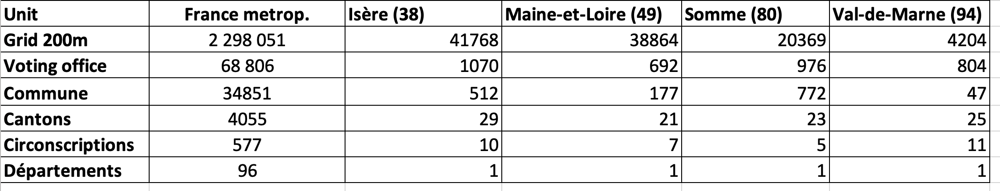

This github directory is used for cartographic experiments in relation with the submission of the REDEC project to the AAPG 2026 of the ANR. We will more precisely focus onthe analysis of four cases studies related to the département of Isère, Maine-et-Loire, Somme and Val-de-Marne. 

## Selection of cases studies

Four département has been carefully chosen as places of experiment of the different methods and concepts developed in previous work packages. These four case studies will be used ex-ante in order to test methods and concepts that will be further applied to the whole territory of France. They will also be used ex-post as proof of concept for researcher and decision maker. And finally they will be used as test for the research of the best way to disseminate the results toward stakeholders and citizens. To achieve this objectives, the four cases studies has  been chosen in order to represent both geographical complexity and political diversity of situations :

–	**Val-de-Marne (94)**  is a metropolitan département located in the suburb of Paris with a very high population density concentrated in very few communes which implies necessarily to break some of them in order to have equal population size in cantons. The political opinion is characterized by  equivalent proportion of votes for left and center-right but very few votes for far-right. 

–	**Isère (38)** offers the case of a département which combines very strong geographical and political differences. The density of population is very high in the metropolitan agglomeration of Grenoble and the related valleys but very low in mountains area.  The political diversity is complete with far-right in the north, far-left in the suburb of Grenoble and center-left or center right elsewhere. 

–	**Somme (80)**  is a good example of rural and industrial area that has been exposed to economic crisis and has recently offers a majority of vote to far-right, with the exception of the capital city of Amiens. Furthermore, the strange shape of some of its districts raises questions. It is also a remarkable case of gerrymandering with  three strange circonscriptions having the form of  an octopus (n°4) and a salamander (n°1) surrounding  a frog (n°2) ...

–	**Maine-et-Loire (49)** located in the Western part of France is  the opposite example of Somme in political terms as it remains a typical area or resistance of center-right or center-left.It is also characterized by an interesting administrative evolution with a strong reduction of the number of communes by merging (Bideau 2024). We arrive at a moment where some cluster of rural communes are larger than cantons. 

## Data collection

We will firstly examine which data can be collected and combine at different levels in each of the selected area. 

## Experiments 

We will then realize preliminary experiments of redisctricting applied to the electoral circonscription. The objective will be to compare the current offcial division against alternative proposals. 

